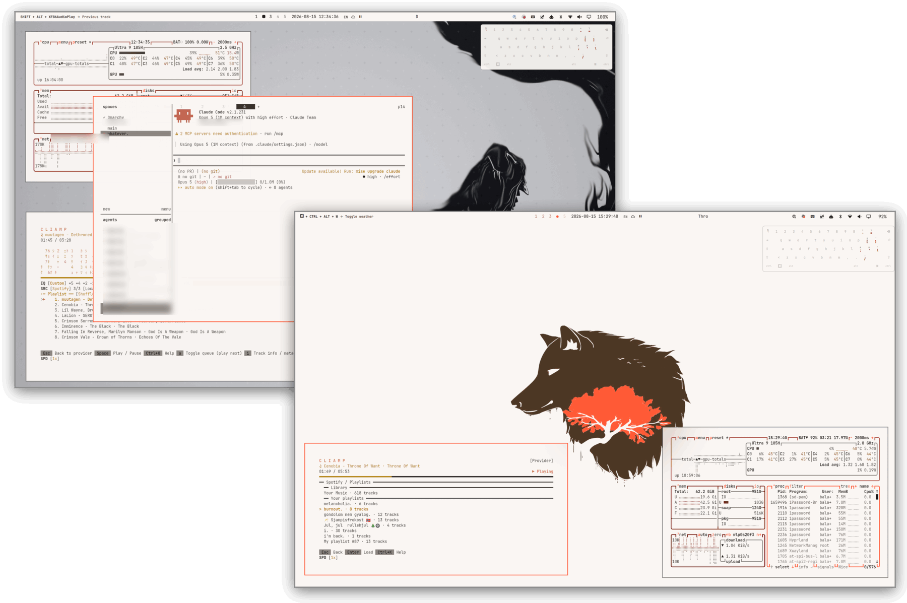

# ulf-light



         

## Install

```bash
omarchy theme install git@github.com:balazsorban44/omarchy-ulf-light-theme.git
```

Dark variant: [balazsorban44/omarchy-ulf-theme](https://github.com/balazsorban44/omarchy-ulf-theme)

To make the desktop's light/dark setting follow the active theme, install the
hook once:

```bash
omarchy hook install theme-set hooks/theme-set.d/gtk-appearance
```

## Credits

Palette inspired by [omarchyplugins.com](https://omarchyplugins.com).
Wallpaper from [wallhaven](https://wallhaven.cc) (`3kx5gd`) — check its licence
before redistributing.

`backgrounds/ulf-2-4k.png` is "Intense Gaze of the Minimalist Wolf" by teedee001
at [Wallpapers.com](https://wallpapers.com/wallpapers/wolf-minimalist-1920-x-1080-wallpaper-is5r0d1quoeztxxq.html),
recoloured to the ulf-light palette — check its licence before redistributing.
